# Flow Diagram Review

Review of *"How the coding agent runs a task"*. The control flow is sound in shape — guard → optimize → plan → schedule → execute → gate → write back → loop — and several things in it are better than what most agent frameworks ship:

- **Declared write sets on plan nodes.** Conflict detection before execution rather than lock contention during it.
- **Checkpoint before mutating calls.** Makes node-level rollback meaningful.
- **Output guard that tags tool results as data, never instructions.** The correct defence against tool-result prompt injection.
- **Artifact spill at 2KB with handle + summary.** Keeps the window from being eaten by one `npm test` dump.
- **A real error taxonomy** (transient / retrieval miss / permission / permanent) instead of one generic retry.
- **Four-tier memory write-back** (T1/T2 delta, T4 lesson, T3 relevance).

Below are the gaps. Severity: **S1** = will corrupt state or hang; **S2** = will misbehave under load or attack; **S3** = missing capability the product needs.

---

## S1 — Correctness and liveness

### F1. Retry exhaustion has no exit edge
`Transient error? → yes → Retry, max 2` rejoins the scheduler loop. If the error classifier is stateless it re-classifies the same failure as transient forever. "max 2" is written on the box but nothing in the flow enforces it.

**Fix.** The attempt counter lives on the node record, not in the classifier. Classification order becomes: `attempts >= max → permanent` *first*, then the taxonomy. Add an explicit `retries exhausted` edge into the permanent branch.

### F2. The reviewer loop is unbounded
`Reviewer approves? → no → attach critique as a hard constraint and re-run the node` has no round cap and no progress check. Two failure modes: infinite critique ping-pong (reviewer keeps finding a new nit), and unbounded growth of the accumulated critique block until it crowds out the node's actual context.

**Fix.** `max_review_rounds` (2–3). Dedup critiques by semantic hash so a re-worded repeat doesn't count as new. On cap, escalate to human rather than loop. Cap the critique block at a fixed slice of the node budget and evict oldest-first.

### F3. Runtime `happens-before` edges can deadlock
`Write set conflicts with a sibling? → yes → add happens-before edge and return node to ready queue`. Edges added in *discovery order* can form a cycle: A discovers a conflict with B and gets ordered after B; later B is pulled, discovers a conflict with A, and gets ordered after A. The ready queue then never produces a node and the DAG hangs — with no timeout in the flow to notice.

**Fix.** Two options, pick one and be strict about it:
1. **Total order on resources.** Canonically sort resource IDs; a node acquires its whole write set in that order or backs off entirely. Deadlock becomes impossible by construction.
2. **Cycle check before commit.** Run the edge through a DAG cycle test; on cycle, break the tie by static node priority instead of adding the edge.

Recommend (1). Also: conflict testing must be **path-prefix and glob aware**, not string equality — `src/` vs `src/api/x.ts` conflict.

### F4. Write sets are declared but never enforced
The planner declares write sets and the scheduler reasons over them, but nothing verifies the sub-agent stayed inside its declaration. A single out-of-set write invalidates every conflict decision the scheduler made.

**Fix.** Enforce at the sandbox boundary — the FS overlay exposes only declared paths as writable; everything else is read-only. An out-of-set write attempt is a hard node failure, not a warning.

### F5. `Escalate to a human (park node, release locks)` is unsafe as drawn
Releasing locks while parked lets a sibling mutate the same resources. When the human approves hours later, the node resumes against a checkpoint that no longer describes the filesystem, and its rollback point is a lie.

**Fix.** Pick one, don't straddle:
- **Retain locks, mark parked.** Scheduler detects starvation and surfaces "cancel node / cancel blocked siblings" to the user.
- **Release locks, invalidate the checkpoint.** On resume the node is forced through full context re-assembly and re-checkpoint.

### F6. Rollback is node-local; there is no cascade invalidation
`Roll back this node's write set` ignores that downstream or parallel-sibling nodes may already have **read** those writes through the join barrier. Rolling back silently leaves consumers holding conclusions derived from data that no longer exists.

**Fix.** Track a **read set** alongside the write set. On rollback, mark every node whose read set intersects the rolled-back write set as dirty and requeue it. This is the single biggest state-corruption risk in the diagram.

### F7. The idempotent cache has no invalidation
`Idempotent cache hit? → yes → serve cached result` is only sound if nothing has mutated the underlying resource since the entry was written. As drawn, a mutating write to `x` followed by a cached `read_file(x)` serves stale bytes.

**Fix.** Cache key = `hash(tool, normalized_args, epoch(resource))`, where `epoch` increments on every committed mutating write to that resource. Only tools declared `pure` in the registry are cacheable at all; network-facing tools require an explicit TTL and are never cached across runs.

---

## S2 — Behaviour under load and attack

### F8. The token budget is checked once, before planning
`Over token budget? → Compact` sits above the planner. But `Re-assemble this node's context with a wider query` in the recovery path can blow the window, and there is no compaction step inside the node loop.

**Fix.** Budget check is a **precondition of every model call**, not a one-time gate. Each node's assembler owns its own compaction against the *selected model's* real context window (see F9 — a 262k Qwen node and a 4k local node have very different budgets).

### F9. Nothing in the flow selects a model
This is the biggest structural gap relative to your goal. With Ollama + LM Studio + llama.cpp + cloud in play, "which model runs this node" is a decision with its own inputs (capabilities, privacy tier, cost, residency) and its own failure modes (provider down, model not resident, context too small, tool calling unsupported). It cannot be an implicit property of the sub-agent.

**Fix.** Insert an explicit **Route** stage between persona load and the tool-call loop, with its own failure edge into the error taxonomy. Add `provider_unavailable` and `capability_mismatch` as first-class error classes. See `03-model-layer.md`.

### F10. "Sandbox" is undefined and carries most of the safety weight
`Execute tool in sandbox` appears twice and is the entire isolation story.

**Fix.** Define tiers explicitly: **T0** in-process (pure functions only), **T1** subprocess with cwd jail, scrubbed env, FS overlay, no network — the default, **T2** container (Docker) for untrusted code or anything needing network. Each tier carries wall-clock timeout, memory cap, and output cap. Note the Windows caveat in `02-architecture.md`: T1 path jailing is enforced by our tool layer, not by the OS.

### F11. The artifact summarizer is an unguarded injection surface
`Output larger than 2KB? → write artifact, return handle plus summary`. The output guard correctly tags the raw result as data — but the *summary* is produced by a model reading untrusted bytes, and that summary flows back into the trusted context unwrapped.

**Fix.** Summarize in a **separate, tool-less, disposable context** using a cheap model, and wrap the result in the same nonce-fenced untrusted-data envelope as the raw output. The summarizer must have no tool access and no memory write permission.

### F12. `Static gates pass?` is a single boolean
Build failure, lint failure, a failing unit test, and a leaked secret have nothing in common in terms of remediation, yet they share one edge.

**Fix.** Gates return a **vector** with per-gate severity: `build`, `typecheck`, `lint`, `unit`, `contract`, `secret-scan`. Only some are auto-retryable; a secret-scan hit is never auto-retried and never rolled back silently — it escalates.

### F13. `Final output / deployment` has no gate
Deployment is irreversible and sits after the last approval point in the flow.

**Fix.** Introduce an **irreversible action class** — deploy, `git push`, package publish, outbound network POST, credential use. The checkpoint/rollback machinery only covers *reversible* mutations; irreversible ones require explicit human approval at the moment of execution regardless of prior plan approval.

---

## S3 — Missing product capabilities

### F14. No cancellation or interrupt path
There is no way for a human to stop a run mid-flight. For an interactive CLI and a desktop app this is mandatory.

**Fix.** Cooperative cancellation token checked at every await point; in-flight tool subprocess gets SIGTERM → SIGKILL; the run is checkpointed so it is resumable rather than lost.

### F15. No cost, token, or latency accounting
Nothing meters spend. With cloud models in the routing pool, a runaway DAG is a billing incident.

**Fix.** Per-node and per-run meters for tokens, wall time, and USD; run-level budget with a **stop-or-ask** gate when a threshold is crossed.

### F16. The plan rejection loop loses the reason
`Approved? → no` returns to `Assemble context` with no channel for *why* it was rejected. The planner will regenerate a near-identical plan.

**Fix.** Rejection reason is captured as a hard planning constraint, and prior rejected plans are included as negative examples.

### F17. Persona is lazy-loaded but never bound to model capability
A `reviewer` persona backed by a 0.8B model produces rubber-stamp approvals; the flow can't tell the difference between that and a real review.

**Fix.** Persona declares **required capabilities** (min context, tools native, reasoning tier), and the router treats them as hard filters.

### F18. No provenance / audit trail
Nothing in the flow records what happened. The desktop timeline UI, run resume, and post-hoc debugging all need it.

**Fix.** Append-only event log as the source of truth. Run state is a fold over events. This gives resume, the timeline view, and deterministic replay for free.

---

## Corrected flow

Changes from the original are marked `*`.

```mermaid
flowchart TD
    START([Start]) --> GUARD[Guard input<br/>PII, injection, scope]
    GUARD --> OPT[Optimize prompt<br/>intent, scope, acceptance criteria]
    OPT --> PRE[Pre-flight<br/>tool registry, permission matrix,<br/>*provider health probe*]
    PRE --> ASM[Assemble context<br/>priority ladder, per-branch budgets]
    ASM --> BUD{Over budget?}
    BUD -- yes --> CMP[Compact<br/>summarize done nodes, evict raw turns]
    CMP --> PLAN
    BUD -- no --> PLAN[Plan DAG<br/>deps, contracts,<br/>*declared read + write sets*]
    PLAN --> APPR{Approved?}
    APPR -- no --> REJ["*Capture rejection<br/>as hard constraint*"]
    REJ --> ASM
    APPR -- yes --> SCHED

    SCHED[Scheduler pulls ready node] --> CANCEL{"*Cancelled?*"}
    CANCEL -- yes --> HALT["*Checkpoint run, halt*"]
    CANCEL -- no --> LOCK{"*Acquire write set<br/>in canonical order*"}
    LOCK -- blocked --> REQ[Add happens-before edge<br/>*cycle-checked*, requeue]
    REQ --> SCHED
    LOCK -- acquired --> PERSONA[Lazy-load persona<br/>spawn sub-agent, isolated window]

    PERSONA --> ROUTE["*Route: select provider + model*<br/>*capabilities, privacy, cost, residency*"]
    ROUTE -- no candidate --> ERR
    ROUTE --> NBUD["*Per-node budget check<br/>vs selected context window*"]
    NBUD --> TOOL[Sub-agent proposes tool call]

    TOOL --> IRREV{"*Irreversible?*"}
    IRREV -- yes --> HUMAN2["*Human approval<br/>at execution time*"]
    HUMAN2 --> EXEC
    IRREV -- no --> MUT{Mutating call?}
    MUT -- yes --> CKPT[Checkpoint write set] --> EXEC
    MUT -- no --> CACHE{"Cache hit?<br/>*key includes resource epoch*"}
    CACHE -- yes --> SERVE[Serve cached result] --> OG
    CACHE -- no --> EXEC[Execute in sandbox<br/>*tier T0/T1/T2*<br/>*write-set enforced by overlay*]

    EXEC --> BUMP["*Bump resource epoch<br/>on committed write*"]
    BUMP --> OG[Output guard<br/>tag as data, nonce-fenced]
    OG --> BIG{Output > 2KB?}
    BIG -- yes --> ART[Write artifact, pin,<br/>return handle + *guarded* summary]
    ART --> JOIN
    BIG -- no --> JOIN[Join barrier]

    JOIN --> GATES["Static gates<br/>*vector: build, types, lint,<br/>unit, contract, secrets*"]
    GATES -- all pass --> REV{Reviewer approves?}
    GATES -- fail --> ERR
    REV -- yes --> WB[Write back<br/>T1/T2 delta, T4 lesson, T3 relevance]
    REV -- "no, rounds < cap" --> CRIT[Attach critique<br/>as hard constraint, re-run]
    CRIT --> TOOL
    REV -- "*no, cap reached*" --> ESC
    WB --> DONE[Mark node done<br/>unpin artifacts, release locks]
    DONE --> COMPLETE

    ERR{"Classify error<br/>*attempts >= max → permanent*"}
    ERR -- transient --> RETRY[Retry, max 2<br/>keep error, drop failed code] --> TOOL
    ERR -- retrieval miss --> WIDEN[Re-assemble with wider query<br/>*+ budget check*] --> TOOL
    ERR -- "*provider down*" --> FB["*Fallback provider<br/>circuit breaker*"] --> ROUTE
    ERR -- permission --> ESC["Escalate to human<br/>*park, retain locks*"]
    ESC --> SCHED
    ERR -- permanent --> RB[Roll back write set]
    RB --> CASC["*Cascade: requeue nodes whose<br/>read set intersects*"]
    CASC --> LESSON[Record failure as lesson] --> COMPLETE

    COMPLETE{DAG complete?}
    COMPLETE -- no --> SCHED
    COMPLETE -- yes --> FINAL{"*Deployment approval gate*"}
    FINAL --> OUT[Final output / deployment] --> END([End])
```

---

## Summary table

| # | Finding | Sev | Fix location |
|---|---|---|---|
| F1 | Retry exhaustion has no exit | S1 | `core/recovery/classifier.ts` |
| F2 | Reviewer loop unbounded | S1 | `core/review/loop.ts` |
| F3 | Runtime edges can deadlock | S1 | `core/scheduler/locks.ts` |
| F4 | Write sets declared, not enforced | S1 | `tools/sandbox/overlay.ts` |
| F5 | Park releases locks unsafely | S1 | `core/scheduler/park.ts` |
| F6 | No cascade invalidation on rollback | S1 | `core/scheduler/rollback.ts` |
| F7 | Cache has no invalidation | S1 | `tools/cache/epoch.ts` |
| F8 | Budget checked once, pre-planning | S2 | `core/context/assembler.ts` |
| F9 | No model selection stage | S2 | `providers/router/` |
| F10 | Sandbox undefined | S2 | `tools/sandbox/` |
| F11 | Summarizer is an injection surface | S2 | `core/guard/output-guard.ts` |
| F12 | Gates are one boolean | S2 | `core/gates/` |
| F13 | Deployment ungated | S2 | `core/approval/irreversible.ts` |
| F14 | No cancellation path | S3 | `core/run/cancellation.ts` |
| F15 | No cost accounting | S3 | `core/budget/` |
| F16 | Rejection reason lost | S3 | `core/plan/replan.ts` |
| F17 | Persona not bound to capability | S3 | `core/persona/registry.ts` |
| F18 | No provenance log | S3 | `core/events/` |
